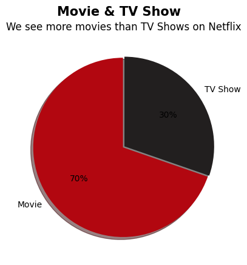

# 6/2

탭 1

# 파이차트

```python
plt.Figure(figsize=(5,5))
plt.pie(type_counts, labels= type_counts.index, autopct='%0.f%%', startangle=90,
        explode=[0.01, 0.01], shadow=True, colors=['#b20710', '#221f1f'])

plt.suptitle('Movie & TV Show', fontsize=15, fontweight='bold')
plt.title('We see more movies than TV Shows on Netflix', fontsize=12)
```



- listed_in안에 있는 자료들을 콤마(,) 기준으로 각 열로 나누자.
- expand = 여러 개의 독립적인 열(Column)로 나누어 데이터프레임(DataFrame) 형태로 반환

```python
netflix['listed_in'].str.split(', ', expand=True)

[결과]
```

| **0** | **1** | **2** |
| --- | --- | --- |
| 0 | Documentaries | NaN |
| 1 | International TV Shows | TV Dramas |
| 2 | Crime TV Shows | International TV Shows |
| 3 | Docuseries | Reality TV |
| 4 | International TV Shows | Romantic TV Shows |
| ... | ... | ... |
| 8785 | Cult Movies | Dramas |
| 8786 | Kids' TV | Korean TV Shows |
| 8787 | Comedies | Horror Movies |
| 8788 | Children & Family Movies | Comedies |
| 8789 | Dramas | International Movies |
- stack()
- 한 행에 하나씩 들어가서 나눠짐.

```python
netflix['listed_in'].str.split(', ', expand=True).stack()

[결과]
0     0             Documentaries
      1                       NaN
      2                       NaN
1     0    International TV Shows
      1                 TV Dramas
                    ...          
8788  1                  Comedies
      2                       NaN
8789  0                    Dramas
      1      International Movies
      2          Music & Musicals
Length: 26370, dtype: str
```

- 이건 중복된 값이 있다.

```python
generes = netflix['listed_in'].str.split(', ', expand=True).stack().value_counts
generes

[결과]
International Movies            2752
Dramas                          2426
Comedies                        1674
International TV Shows          1349
Documentaries                    869
Action & Adventure               859
TV Dramas                        762
Independent Movies               756
Children & Family Movies         641
Romantic Movies                  616
Thrillers                        577
TV Comedies                      573
Crime TV Shows                   469
Kids' TV                         448
Docuseries                       394
Music & Musicals                 375
Romantic TV Shows                370
Horror Movies                    357
Stand-Up Comedy                  343
Reality TV                       255
British TV Shows                 252
Sci-Fi & Fantasy                 243
Sports Movies                    219
Anime Series                     174
Spanish-Language TV Shows        173
...
Stand-Up Comedy & Talk Shows      56
Movies                            53
Classic & Cult TV                 26
TV Shows                          16
Name: count, dtype: int64
```

```python
plt.figure(figsize=(12,6))

# hue=generes.index => 그래프별로 색깔을 차등으로 주겠다. palette = 'RdGy'-> 색깔지정
# x값 y값만 잘 넣어줘도 차트 하나 만들 수 있음.
sns.barplot(x=generes.values, y=generes.index, hue=generes.index, palette='coolwarm')
```


```python
netflix = pd.read_csv('netflix_titles.csv')
netflix.head(1)

netflix['country'] = netflix['country'].str.split(',')
netflix['country']

[결과]
0       [United States]
1        [South Africa]
2             [No Data]
3             [No Data]
4               [India]
             ...       
8785    [United States]
8786          [No Data]
8787    [United States]
8788    [United States]
8789            [India]
Name: country, Length: 8790, dtype: object
```

```python
netflix_age_country = netflix.explode('country')
netflix_age_country

[결과]
```


- title열의 전체 데이터에서 ‘Sankofa’라는 데이터가 포함되어 있는(contains) 행을 찾는다.
- → query함수로도 가능한데 이건 case(대소문자 구분하기)를 못써서 실용성이 떨어지는 것 같음
- 만약 title열의 전체 데이터 중 빈 값(na=False) 있어도 False로 처리하여 에러를 내지 않도록 하고,
- 그리고 대소문자 구분을 없애도록 하자(case=False)

```python
netflix_age_country[netflix_age_country['title'].str.contains('Sankofa',na=False,case=False)]
```

- div → 각 행의 데이터에 대해 열의 비율을 구해주는 함수
- 각 열(axis = 0)의 합을 구해서 전체 총합으로 나누는 방법으로
- 총합 대비 데이터별 비율을 구한다.
- 나누는 방향은 세로방향(axis=1)

```python
netflix_age_country_unstack = netflix_age_country_unstack.div(netflix_age_country_unstack.sum(axis=0), axis=1)
netflix_age_country_unstack
```

- 이제 히트맵 만들기

```python
sns.heatmap(netflix_age_country_unstack)
```


```python
# fmt = 소수점 0자리, .1이면 1자리, .2면 2자리
plt.figure(figsize=(15,5))
cmap = plt.matplotlib.colors.LinearSegmentedColormap.from_list('', ['#221f1f','#b20710','#f5f5f1'])
sns.heatmap(netflix_age_country_unstack, cmap=cmap, linewidths=2.5, annot=True, fmt='.0%')
```


## WordCloud

```python
from wordcloud import WordCloud
from PIL import Image

plt.figure(figsize=(15,5))

# 이미지 파일을 열기
mask = np.array(Image.open('netflix_logo.jpg'))

# 배경 = 화이트, 가로길이 = 1400, 세로길이 1400, 최대 글자 수 = 100
# width와 height를 줄이면, **화질이 안좋아짐**
WordCloud = WordCloud(background_color='white', width=1400, height=1400, max_words=1000,
                      mask=mask, colormap=cmap).generate(text)

plt.imshow(WordCloud)

plt.axis('off')
plt.show()

[결과]
```


## sav파일을 읽기 위해, 가상환경 안의 터미널에서 pip install pyreadstat 입력

- subset은 dropna에게 ‘income’열만 검사해서 na인 데이터를 삭제해라고 명령할 파라미터다.

```python
# 'income'은 성별별 월평균 수입
# 일단 'income'에 na를 drop하고, sex열을 기준으로 그룹해서 agg로 income의 mean을 구해라
# as_index를 False로 하지 않으면 가장 앞에 있는 sex열이 index가 되어 출력된다

sex_income = welfare.dropna(subset='income') \
    .groupby('sex', as_index = False) \
        .agg(mean_income = ('income', 'mean'))

sex_income
```

| **sex** | **mean_income** |
| --- | --- |
| 0 | female |
| 1 | male |

# 가설검정

통계학에서 중요한 도구로서 어떤 주장이나 가설이 **사실인지를 판단**

어떤 주장이 통계적으로 유의미한지, 데이터를 사용하여 확인하고 결론을 내림

- 예) 가설검정이 사용되는 상황
    - 신약효과 평가
    - 제품 개발 및 마케팅
    - 교육 효과 분석
- 가설검정의 단계
    - 1단계: 문제 정의와 목표 설정
    - **2단계: 가설 설정**
        - 귀무가설 : 현재 상황을 설명하거나 이전 연구결과를 가정하는 가설
        이전 연구까지의 진실을 연구하므로 **부정적인 주장이 주를 이룸**
        ex) 6기까지는 취업을 잘했다.(이건 과거 데이터이므로 진실) 그렇다면 7기도 잘될까?
        - 대립가설 : 연구자가 증명하려는 주장
        일반적으로 귀무가설과 반대되는 주장
        연구 결과에 차이가 있다고 주장
    - 3단계: 표본 추출과 데이터 수집
    - 4단계: 검정 통계량 계산
    - 5단계: 4단계의 통계량을 바탕으로 유의성 검정 및 임계치(경계선) 설정
        - 유의성 검정 : 계산한 검정 통계량을 사용하여 수행
        귀무가설을 기각할지 결정
        - 유의수준과 연관된 임계치를 정의하고 검정 통계량과 비교하여 귀무가설을 기각 또는 채택
    - 6단계: 결론 도출과 결과 해석

## 귀무가설 vs 대립가설


- 예제


에너지 음료를 먹은 사람과 먹지 않은 사람의 시험 성적에 관한 데이터 수집

p값이 0.5 이하면 귀무가설 기각

### ttest_ind()

- 두 그룹의 평균이 같은지 다른지 확인하려고 이 t-test를 돌리는 것인데, "평균이 달라서 이 옵션을 줬다"고 하면 앞뒤가 맞지 않게 됩니다.
- **`equal_var=True` (기본값):** "레드와인 품질이 퍼진 모양새나 화이트와인 품질이 퍼진 모양새나 대충 비슷할 거야"라고 가정하고 계산하는 뼈대(Student's t-test)입니다.
- **`equal_var=False`:** "레드와인과 화이트와인은 애초에 생산량(데이터 개수)도 다르고, 품질이 퍼져있는 형태(분산)도 다를 테니 **서로 분산이 다르다고 가정하고 더 안전하게 계산해 줘**"라는 뜻입니다. 통계학에서는 이를 웰치의 t-검정(Welch's t-test)이라고 부릅니다.

```python
# 두 그룹(레드,화이트와인)의 품질 평균이 통계적으로 유의미한 차이가 있는가?
# 귀무가설 => 레드와인과 화이트와인의 품질 평균은 차이가 없다.
# 결론 = 차이가 있다
# equal_var를 False로 한 이유 -> 비교하는 두 표본의 분산이 다르기 때문
stats.ttest_ind(red_wine_quality, white_wine_quality, equal_var=False)
# pvalue값이 중요 (보면 -24승으로 매우매우 많이 적음)
# 그러므로 귀무가설의 기각역에 들어갔다.
# 평균의 퀄리티가 차이 없다는 가설(귀무가설)은 기각
```

TtestResult(statistic=np.float64(-10.149363059143164), pvalue=np.float64(8.168348870049669e-24), df=np.float64(2950.750452166697))

```
# 📝 와인 데이터 분석 & 가설검정 연습 문제

## 1부: 객관식 문항 (개념 및 이론)

### Q1. 가설검정 교재에 제시된 '가설검정 6단계'의 순서가 올바르게 나열된 것은?
v * ① 가설 설정 ➔ 문제 정의 ➔ 데이터 수집 ➔ 통계량 계산 ➔ 유의성 검정 ➔ 결론 도출
* ② 문제 정의와 목표 설정 ➔ 가설 설정 ➔ 표본 추출과 데이터 수집 ➔ 검정 통계량 계산 ➔ 유의성 검정 및 임계치 설정 ➔ 결론 도출과 결과 해석
* ③ 가설 설정 ➔ 데이터 수집 ➔ 유의성 검정 ➔ 임계치 설정 ➔ 통계량 계산 ➔ 결과 해석
* ④ 문제 정의 ➔ 표본 추출 ➔ 검정 통계량 계산 ➔ 가설 설정 ➔ 결론 도출 ➔ 유의성 검정

### Q2. `10_wine.ipynb` 노트북에서 수행한 "레드와인과 화이트와인의 품질 평균 차이 분석"에 대한 가설 설정으로 올바르지 않은 것은?
* ① 귀무가설(H0): 레드와인과 화이트와인의 품질 평균은 차이가 없다.
* ② 대립가설(H1): 레드와인과 화이트와인의 품질 평균은 차이가 있다.
* ③ 귀무가설(H0)은 일반적으로 연구 결과에 차이가 없음을 주장하는 보수적인 가설이다.
v * ④ 대립가설(H1)은 이전 연구 결과를 그대로 가정하며 반드시 부정적인 형태로 설정해야 한다.

### Q3. 노트북 코드 중 `stats.ttest_ind(red_wine_quality, white_wine_quality, equal_var=False)`를 실행했습니다. 여기서 `equal_var=False` 매개변수를 명시한 통계학적 의미로 가장 올바른 것은?
* ① 두 그룹의 표본 평균이 서로 다르다고 가정하기 때문
* ② 두 그룹의 데이터 개수(행 수)가 완벽히 같다고 가정하기 때문
v * ③ 두 비교 그룹(레드와인과 화이트와인)의 모집단 분산이 서로 다르다고 가정하기 때문
* ④ 분석 결과인 p-value 값을 더 크게 만들기 위함

### Q4. 와인 품질에 대한 t-검정 결과 p-value가 `8.168348870049669e-24`로 계산되었습니다. 이에 대한 통계적 해석과 결론으로 옳은 것은?
* ① p-value가 유의수준 0.05보다 크므로 귀무가설을 채택한다.
* ② 두 와인의 품질 평균이 같을 확률이 매우 높으므로 차이가 없다고 결론 내린다.
v * ③ p-value가 0에 극단적으로 가까우므로 귀무가설의 기각역에 들어가며, 두 와인의 품질 평균에는 통계적으로 유의미한 차이가 있다.
* ④ 데이터 수집 과정(표본 추출)에서 심각한 오류가 발생했음을 의미하므로 재실험해야 한다.

### Q5. 유의수준이 0.05(5%)일 때, 양측검정(Two-tailed Test)과 단측검정(One-tailed Test)의 기각역 및 임계값에 대한 설명 중 틀린 것은?
* ① 양측검정에서는 오류의 확률을 균등하게 두 극단에 배분하여 상위 2.5%와 하위 2.5% 영역에서 귀무가설을 기각한다.
* ② 표준정규분포(Z-검정) 기준 양측검정의 임계값은 ±1.96이다.
* ③ 우측검정은 특정 조치나 상황이 결과를 감소시킬 것이라는 예상을 하고 있을 때 적용한다.
* ④ 우측검정의 기각역은 검정 통계량이 임계값 +1.6449보다 크거나 같을 때 형성된다.

---

```

## 2부: 코딩 테스트 문항 (Pandas & Scipy 실전)

### Q6. 세미콜론(`;`)으로 컬럼이 구분되어 있는 `'./winequality-red.csv'` 파일을 올바르게 읽어와 `red_df` 변수에 저장하는 코드를 작성하세요.

```python
import pandas as pd
# 여기에 코드를 작성하세요.

### Q7. 두 와인 데이터프레임 `red_df`와 `white_df`를 위아래로 이어 붙여 하나의 데이터프레임 `wine`으로 합치고, 컬럼명 내부의 공백(스페이스바)을 언더바(`_`)로 한꺼번에 변경하는 코드를 작성하세요.

Python

```
# 1. 두 데이터프레임 결합
wine =

# 2. 컬럼명의 공백을 언더바(_)로 교체
wine.columns =
```

### Q8. 결합된 `wine` 데이터프레임에서 와인 종류(`type`)별로 그룹을 지어, 품질(`quality`) 데이터의 요약 통계량(개수, 평균, 표준편차 등)을 한눈에 확인하는 Pandas 구문을 작성하세요.

Python

```
# 여기에 코드를 작성하세요.
```

### Q9. `wine` 데이터프레임에서 불리언 인덱싱(`loc` 등)을 활용하여, `type`이 `'red'`인 행의 `'quality'` 열 데이터만 쏙 뽑아 `red_wine_quality` 변수에 저장하는 코드를 작성하세요.

Python

```
# 여기에 코드를 작성하세요.
red_wine_quality =
```

### Q10. scipy의 t-검정 결과로 나온 `pvalue` 값이 존재할 때, 유의수준 0.05를 기준으로 귀무가설을 기각할 수 있는지 여부를 판단하여 결론을 출력하는 `if-else` 조건문 코드를 완성하세요.

Python

```
import numpy as np
# 가상의 t-검정 결과 p-value 값
pvalue = 8.168348870049669e-24

# 조건문을 완성하여 결과를 출력하세요.
if
    print("결론: 귀무가설 기각 (두 와인의 품질 평균은 유의미한 차이가 있다)")
else:
    print("결론: 귀무가설 기각 실패 (두 와인의 품질 평균은 차이가 없다)")
```

탭 2

탭 3